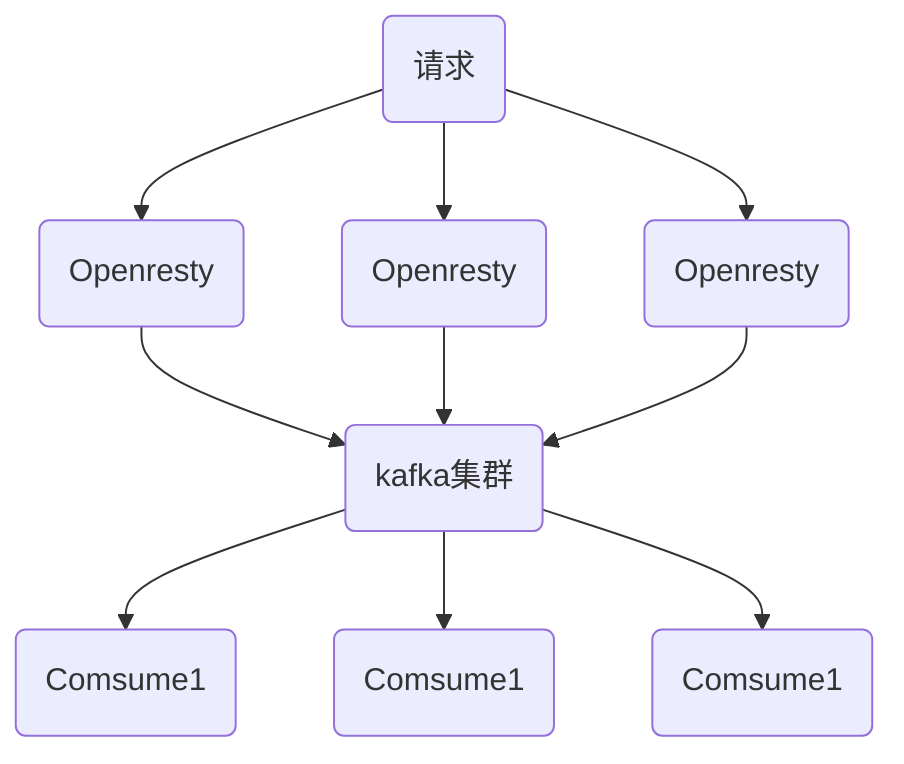

### openresty
> 基于nginx和lua的高性能web平台， 其内部集成了大量精良的lua库，第三方模块以及大多数的依赖项。用于方便搭建能给处理超高并发，扩展性极高的动态web应用，web服务，动态网关。

#### 简单来说，web服务运行在nginx服务内部，利用nginx非阻塞的I/O模型，提供高性能响应。


### 流程图


> Openresty 请求kakfa，可同步或异步

### 优点
1. 支持多业务数据，不同业务配置不同lua脚本，就可以转发到不同的kafka的topic中。
2. 高可靠的集群，具有高性能和稳定性。
3. 高并发，可以处理上完并发量。

### 票务处理
1. php消费kafka数据，进行整理
2. lua-resty-kafka 依赖

### 步骤
1. 下载Openresty yum install readline-devel pcre-devel openssl-devel gcc
2. 编译Openresty make & make install
3. 安装lua-resty-kafka
4. 安装kafka
5. 修改nginx.conf
```nginx
user  nginx;  #Linux的用户
worker_processes  auto;
worker_rlimit_nofile 100000;
 
#error_log  logs/error.log;
#error_log  logs/error.log  notice;
#error_log  logs/error.log  info;
 
#pid        logs/nginx.pid;
events {
    worker_connections  102400;
    multi_accept on;
    use epoll;
}
 
http {
    include       mime.types;
    default_type  application/octet-stream;
 
    log_format  main  '$remote_addr - $remote_user [$time_local] "$request" '
                      '$status $body_bytes_sent "$http_referer" '
                      '"$http_user_agent" "$http_x_forwarded_for"';
 
    access_log  /var/log/nginx/access.log  main;
 
    resolver 8.8.8.8;
    #resolver 127.0.0.1 valid=3600s;
 
    sendfile        on;
 
    keepalive_timeout  65;
 
    underscores_in_headers on;
 
    gzip  on;
 
    include /opt/openresty/nginx/conf/conf.d/common.conf; #common.conf这个文件名字可自定义
 
}
```
6. 编辑Openresty中common.conf
```nginx
##api
lua_package_path "/opt/openresty/lualib/resty/kafka/?.lua;;";
lua_package_cpath "/opt/openresty/lualib/?.so;;";
 
lua_shared_dict ngx_cache 128m;  # cache
lua_shared_dict cache_lock 100k; # lock for cache
 
server {
    listen       8887; #监听端口
    server_name  192.168.3.215; #埋点日志的ip地址或域名，多个域名之间用空格分开
    root         html; #root指令用于指定虚拟主机的网页根目录，这个目录可以是相对路径，也可以是绝对路径。
    lua_need_request_body on; #打开获取消息体的开关，以便能获取到消息体
 
    access_log /var/log/nginx/message.access.log  main;
    error_log  /var/log/nginx/message.error.log  notice;
 
    location = /lzp/message {
        lua_code_cache on;
        charset utf-8;
        default_type 'application/json';
        content_by_lua_file "/opt/openresty/nginx/lua/testMessage_kafka.lua";#引用的lua脚本
    }
}
```
7. lua脚本
```lua
-- #创建目录mkdir /opt/openresty/nginx/lua/
-- vim /opt/openresty/nginx/lua/testMessage_kafka.lua<br>#编辑内存如下：

-- require需要resty.kafka.producer的lua脚本，没有会报错
local producer = require("resty.kafka.producer")
 
-- kafka的集群信息，单机也是可以的
local broker_list = {
    {host = "192.168.3.215", port = 9092},
}
 
-- 定义最终kafka接受到的数据是怎样的json格式
local log_json = {}
--增加read_body之后即可获取到消息体，默认情况下可能会是nil
log_json["body"] = ngx.req.read_body()
log_json["body_data"] = ngx.req.get_body_data()
 
-- 定义kafka同步生产者，也可设置为异步 async
-- -- 注意！！！当设置为异步时，在测试环境需要修改batch_num,默认是200条，若大不到200条kafka端接受不到消息
-- -- encode()将log_json日志转换为字符串
-- -- 发送日志消息,send配套之第一个参数topic:
-- -- 发送日志消息,send配套之第二个参数key,用于kafka路由控制:
-- -- key为nill(空)时，一段时间向同一partition写入数据
-- -- 指定key，按照key的hash写入到对应的partition
 
-- -- batch_num修改为1方便测试
local bp = producer:new(broker_list, { producer_type = "async",batch_num = 1 })
-- local bp = producer:new(broker_list)
 
local cjson = require("cjson.safe")
local sendMsg = cjson.encode(log_json)
local ok, err = bp:send("testMessage",nil, sendMsg)
if not ok then
   ngx.log(ngx.ERR, 'kafka send err:', err)
elseif ok then
   ngx.say("the message send successful")
else
   ngx.say("未知错误")
end
```


### kafka
> 高吞吐量的分布式发布订阅消息系统

* producer: 生成者
* broker：broker是kafka实例，每个服务器都有一个或多个kafka实例。用于存储消息，有多个server组成的集群。
* topic：消息的主题，消息的分类，kafka数据保存在topic。每个broker可以创建多个topic。
* partition：topic分区，每个topic分区可以有多个分区，分区作用是负载，提高kafka的吞吐量。同一个topic在不同分区的数据是不重复的。表现形式类似文件夹。
* message：消息。
* consumer：消费者，消费的出口。
* consumer group：我们可以把多个消费者组成一个消费者组，在kafka的设计中，同一个分区的数据只能被消费者组中某一个消费者消费。
* zookeeper: kafka依赖zookeeper保存集群元信息，保证系统的可用性。

### 存储策略
1. 基于时间默认配置168小时，默认7天
2. 基于大小，默认1073741824

### topic与message
1. kafka将消息组织成多个topic的形式存储，每个topic可以拆分为多个partition，每个partition由一个一个消息组成。每个消息都被标识了一个递增的序号代表进来的先后的顺序，按照顺序存储在partition中。
* produce选中一个topic，生成消息，然后通过分配append到某个partition后面。
* consumer选中一个topic，根据id的指定的哪个位置进行消费信息。消费成功后保留id，下次从这个位置继续消费，也可以选择其他位置开始消费。

### 优点
1. id即为offset，消费者可以根据offset进行消费。灵活指定消费
2. 每个consumer保留自己的offset，互不干扰，不存在线程安全。保证并发消费线程安全。
3. 消息访问的并行高效性。topic的信息被组织成多个partition，partition均匀分配给集群server中。生成，消费信息时，指定到相应的partition，减少竞争，增加了程序的并行能力。
4. 增加消息系统的可伸缩性。每个topic保留的信息非常庞大，可以通过partition切分为不同子消息，通过负载均衡分配到不同的server中。
5. 消息可靠性，消费后，信息不会删除，只是重置offset。
6. 灵活持久化策略，通过指定时间段，保存消息，节省broker空间。
7. 备份高可用性。消息以partition单位分配多个server，以partition为单位进行备份。备份策略，1个leader和n个follower。leader接受读写，follower被动复制leader。leader和follower会分散存储在集群中，保证partition高可用。


### producer
* topic: 往哪个topic生产消息
* partition: 往哪个partition生产消息
* key: 根据key区分不同partition
* message: 消息

### 持久化
* 硬盘便宜，内存贵
* 顺序读，预读取操作，提高缓存命中率
* kafka操作简单，根据offset读，和append操作，基于时间复杂度o（1）

### kafka zookeeper
> zookeeper用于分布式系统协调，zookeeper协调kafka各个broker，不仅可以实现broker的负载均衡，当broker增加或者故障，通知消费者和生产者，保证系统运行正常运行。
### offset消费者
1. high level api ： zookeeper维护消费者offset
2. low level api ：业务代码维护offset

### kafka工作流程
1. producer定期向topic发送消息。
2. kafka broker将所有消息保存为该topic的分区中。可分区存储。
3. consumer订阅topic。
4. 一旦消费者订阅了topic，kafka向consumer提供topic当前offset，并保存到zookeeper中。
5. consumer根据offset定期获取kafka消息。
6. kafka收到producer的消息，将会转发给consumer。
7. consumer接收消息处理。
8. 消息被处理，通知kafka broker发送确认。
9. kafka broker确认，更新offset新值。并在zookeeper中保留。