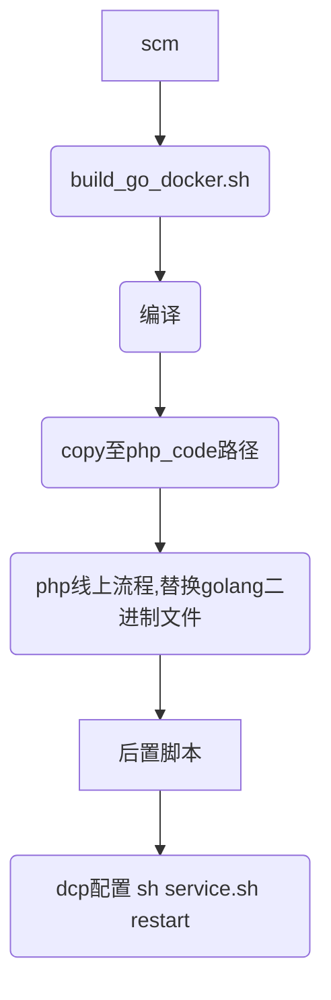

#### golang部署上线

### 流程图

```mermaid
graph TB
    scm --> shell(build_go_docker.sh) --> build(编译)
    build --> copy(copy至php_code路径) --> php(php线上流程,替换golang二进制文件)
    php --> 后置脚本 --> restart(dcp配置 sh service.sh restart)

```