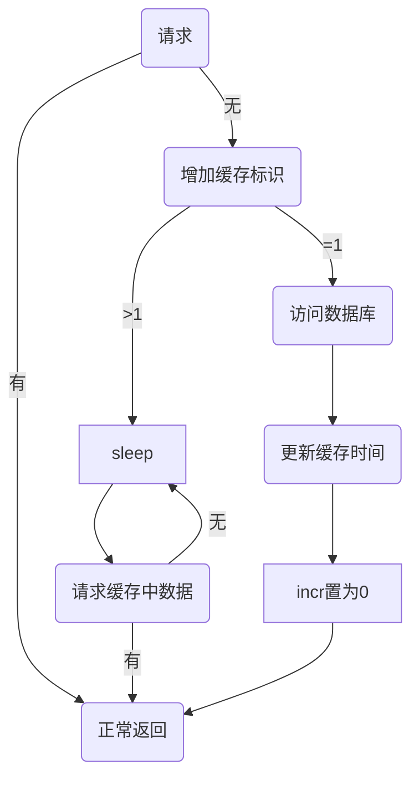

### 数据库缓存方案
* 常规操作
> 客户端请求，web服务器从redis读取数据，如命中，返回数据；如未命中，读取数据库。

* 极端情况
> 缓存失效，突然并发多个请求，请求将直接请求数据库，并且进而导致大量redis的set操作。

* 优化方案
1. 定时脚本。定期更新缓存，保证缓存随时生效。
>  全部资源缓存，造成资源浪费，增加开销。
2. 哨兵模式，缓存没有命中，只有一个请求访问数据库，更新缓存，其他请求等待。

#### 哨兵模式方案
* 流程图


#### 哨兵失败解决方案
> 如果哨兵失败，导致incr缓存标志一直增加，无法更新到缓存中，也获取不到缓存。

1. 手动设置incr为0。
2. incr设置上限，达到上限置为0，重新选择哨兵。
3. 选择哨兵条件=1，调整为取余等其他方式，增加哨兵数量。


#### golang 防止缓存击穿 singleflight
```go
import "golang.org/x/sync/singleflight"
```
> singleflight实现方案：新建singleflight.Group，使用Do或者DoChan来封装方法，对于同一个key，只会有一个协程执行，其他协程等待这个协程执行成功，拿到同样结果。

* Group结构体
> 同一个group中，同样的key只能被执行一次。
* Do方法
```go
func (g *Group) Do(key string, fn func() (interface{}, error)) (v interface{}, err error, shared bool)
```
> 1. key: 同一个key，同时只有一个协程执行。
> 2. fn: 被封装的函数。
> 3. v:返回值，即执行结果，其他等待协程都会拿到。
> 4. shared:表示其他协程获取到这个v。
* DoChan方法
```go
func (g *Group) DoChan(key string, fn func() (interface{}, error)) <-chan Result
```
> 与Do方法一样，返回一个channel，执行结果发送给channel，其他等待协程都能从channel获取到结果。

```go
func main() {
	var singleSetCache singleflight.Group

	getAndSetCache:=func (requestID int,cacheKey string) (string, error) {
		fmt.Printf("request %v start to get and set cache...\n",requestID)
		value,_, _ :=singleSetCache.Do(cacheKey, func() (ret interface{}, err error) {//do的入参key，可以直接使用缓存的key，这样同一个缓存，只有一个协程会去读DB
			fmt.Printf("request %v is setting cache...\n",requestID)
			time.Sleep(3*time.Second)
			fmt.Printf("request %v set cache success!\n",requestID)
			return "VALUE",nil
		})
		return value.(string),nil
	}

	cacheKey:="cacheKey"
	for i:=1;i<10;i++{//模拟多个协程同时请求
		go func(requestID int) {
			value,_:=getAndSetCache(requestID,cacheKey)
			fmt.Printf("request %v get value: %v\n",requestID,value)
		}(i)
	}
	time.Sleep(20*time.Second)
}

```

### 源码
* Group
```go
type Group struct {
    mu sync.Mutex
    m map[string]*call //保存key对应的函数执行过程和结束的变量
}
```
> group的结构简单，锁用于保证并发安全，map用于保存key对应函数执行过程和结果变量。
* call
```go
type call struct {
    wg sync.WaitGroup   // 用waitgroup实现只有一个协程执行函数
    val interface{}     // 函数执行结果
    err Error
    forgotten bool
    dups int            // 含义dupliactions，即同时执行同一个key的协程数量
    chans []chan<- Result
}
```
* Do 
```go
func (g *Group) Do(key string, fn func() (interface{}, error)) (v interface{}, err error, shared bool) {
   g.mu.Lock()//写Group的m字段时，加锁保证写安全。
   if g.m == nil {
      g.m = make(map[string]*call)
   }
   if c, ok := g.m[key]; ok {//如果key已经存在，说明已经有协程在执行，则dups++，并等待其执行完毕后，返回其执行结果，执行结果保存在对应的call的val字段里
      c.dups++
      g.mu.Unlock()
      c.wg.Wait()
      return c.val, c.err, true
   }
   //如果key不存在，则新建一个call，并使用WaitGroup来阻塞其他协程，同时在m字段里写入key和对应的call
   c := new(call)
   c.wg.Add(1)
   g.m[key] = c
   g.mu.Unlock()

   g.doCall(c, key, fn)//第一个进来的协程来执行这个函数
   return c.val, c.err, c.dups > 0
}
```
* g.doCall
```go
func (g *Group) doCall(c *call, key string, fn func() (interface{}, error)) {
   c.val, c.err = fn()//执行被包装的函数
   c.wg.Done()//执行完毕后，就可以通知其他协程可以拿结果了

   g.mu.Lock()
   if !c.forgotten {//其实这里是为了保证执行完毕之后，对应的key被删除，Group有一个方法Forget（key string），可以用来主动删除key，这里是判断那个方法是否被调用过，被调用过则字段forgotten会置为true，如果没有被调用过，则在这里把key删除。
      delete(g.m, key)
   }
   for _, ch := range c.chans {//将执行结果发送到channel里，这里是给DoChan方法使用的
      ch <- Result{c.val, c.err, c.dups > 0}
   }
   g.mu.Unlock()
}
```


### DoChan
* 示例
```go
func main() {
   var singleSetCache singleflight.Group

   getAndSetCache:=func (requestID int,cacheKey string) (string, error) {
      log.Printf("request %v start to get and set cache...",requestID)
      retChan:=singleSetCache.DoChan(cacheKey, func() (ret interface{}, err error) {
         log.Printf("request %v is setting cache...",requestID)
         time.Sleep(3*time.Second)
         log.Printf("request %v set cache success!",requestID)
         return "VALUE",nil
      })

      var ret singleflight.Result

      timeout := time.After(5 * time.Second)

      select {//加入了超时机制
      case <-timeout:
         log.Printf("time out!")
         return "",errors.New("time out")
      case ret =<- retChan://从chan中取出结果
         return ret.Val.(string),ret.Err
      }
      return "",nil
   }

   cacheKey:="cacheKey"
   for i:=1;i<10;i++{
      go func(requestID int) {
         value,_:=getAndSetCache(requestID,cacheKey)
         log.Printf("request %v get value: %v",requestID,value)
      }(i)
   }
   time.Sleep(20*time.Second)
}
```

* DoChan
```go
func (g *Group) DoChan(key string, fn func() (interface{}, error)) <-chan Result {
   ch := make(chan Result, 1)
   g.mu.Lock()
   if g.m == nil {
      g.m = make(map[string]*call)
   }
   if c, ok := g.m[key]; ok {
      c.dups++
      c.chans = append(c.chans, ch)//可以看到，每个等待的协程，都有一个结果channel。从之前的g.doCall里也可以看到，每个channel都给塞了结果。为什么不所有协程共用一个channel？因为那样就得在channel里塞至少与协程数量一样的结果数量，但是你却无法保证用户一个协程只读取一次。
      g.mu.Unlock()
      return ch
   }
   c := &call{chans: []chan<- Result{ch}}
   c.wg.Add(1)
   g.m[key] = c
   g.mu.Unlock()

   go g.doCall(c, key, fn)

   return ch
}
```